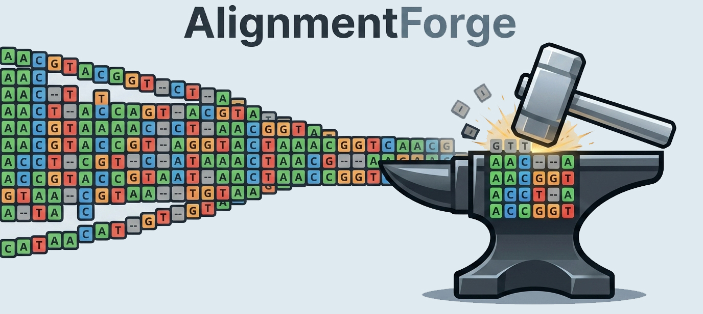
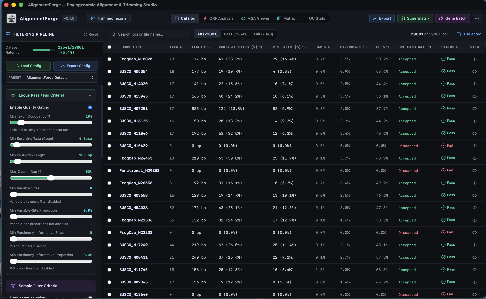
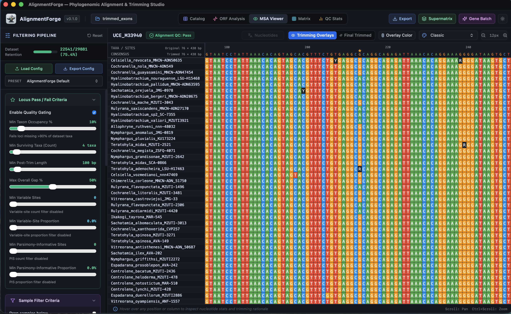

<p align="center">
  
</p>

# AlignmentForge — phylogenomic alignment & trimming studio

AlignmentForge is an interactive visual software tool for exploring, filtering, trimming, and curating multilocus phylogenomic alignments.

## Interfaces

<p align="center">
  
  &nbsp;
  
</p>
<p align="center">
  <em>Left: The General Catalog interface displaying an overview of sequences and projects. Right: The detailed Sequence Alignment view showing the nucleotide matrix.</em>
</p>

You can inspect sequences, filter them by quality, trim ends, and easily select the best data for your phylogenetic analysis directly in the browser or on your desktop.

**[▶ Try it in your browser](https://phyloforge.github.io/AlignmentForge/?run=example_data)** —
no installation, with example data.

---

## Running it

There are two ways to run AlignmentForge. They are the same application. Use the one you prefer.

| | Use when |
|---|---|
| [1. In a browser](#1-in-a-browser) | Simplest. Nothing to install, works on any OS |
| [2. As a desktop app](#2-as-a-desktop-app) | You want full local filesystem access, offline capability, and maximum performance |

### 1. In a browser

Open **<https://phyloforge.github.io/AlignmentForge/>**. Click the folder icon to open a directory, then select a folder on your computer that contains alignment files.

AlignmentForge uploads nothing. The page reads the folder locally on your machine through the browser's file picker. Your data stays entirely on your device.

### 2. As a desktop app

Download the installer for your operating system (macOS, Windows, or Linux) from the [latest release](https://github.com/PhyloForge/AlignmentForge/releases/latest).

The desktop app gives you complete, unrestricted access to your local filesystem. It can seamlessly read massive folders and write your filtered output datasets back to disk without prompting you for browser permissions.

---

## Try it with the example datasets

You do not need your own alignments to see how AlignmentForge works. This repository ships with several real datasets so you can try out the software right away.

### Exon-only alignments

`public/example_data/exons/` — Ten exon-only PHYLIP alignment files for frog phylogenomics.

**[▶ Open it live](https://phyloforge.github.io/AlignmentForge/?run=example_data/exons)**

| Get it | How |
|---|---|
| [Browse it on GitHub](https://github.com/PhyloForge/AlignmentForge/tree/main/public/example_data/exons) | See the sample files |
| [Download the whole repository](https://github.com/PhyloForge/AlignmentForge/archive/refs/heads/main.zip) | `public/example_data/exons/` is inside it |

### UCE alignments

`public/example_data/uces/` — Ten Ultraconserved Element (UCE) alignments for testing.

**[▶ Open it live](https://phyloforge.github.io/AlignmentForge/?run=example_data/uces)**

| Get it | How |
|---|---|
| [Browse it on GitHub](https://github.com/PhyloForge/AlignmentForge/tree/main/public/example_data/uces) | See the sample files |
| [Download the whole repository](https://github.com/PhyloForge/AlignmentForge/archive/refs/heads/main.zip) | `public/example_data/uces/` is inside it |

### All markers combined

`public/example_data/all_markers/` — A mix of different marker types in a single folder.

**[▶ Open it live](https://phyloforge.github.io/AlignmentForge/?run=example_data/all_markers)**

| Get it | How |
|---|---|
| [Browse it on GitHub](https://github.com/PhyloForge/AlignmentForge/tree/main/public/example_data/all_markers) | See the sample files |
| [Download the whole repository](https://github.com/PhyloForge/AlignmentForge/archive/refs/heads/main.zip) | `public/example_data/all_markers/` is inside it |

### Loading an example on your machine

1. Download or clone this repository:
```bash
git clone https://github.com/PhyloForge/AlignmentForge.git
```
2. Open AlignmentForge (either the web or desktop version).
3. Click to open a folder.
4. Select `AlignmentForge/public/example_data/exons` or one of the other example folders.

---

## What to load into AlignmentForge

Select any directory on your computer that holds alignment files.

AlignmentForge reads these file types:

| Format | Extensions |
|---|---|
| FASTA | `.fa`, `.fasta`, `.fna`, `.ffn` |
| PHYLIP | `.phy`, `.phylip` |
| NEXUS | `.nex`, `.nexus` |
| Detected from content | `.aln`, `.txt` |

PHYLIP and NEXUS files can be sequential or interleaved. AlignmentForge
searches the selected folder and up to three levels of subfolders. It skips
hidden folders and files, and folders named `node_modules`, `target`, and
`__MACOSX`.

Every sequence in an alignment must have the same length. AlignmentForge
reports a file it cannot read and continues with the rest of the folder.

AlignmentForge reads nucleotide alignments only. It changes these symbols
when it reads a file:

- `.` and `*` become `-` (gap).
- `X` becomes `N` (unknown base).

A NEXUS file can declare its own GAP, MISSING, and MATCHCHAR symbols.
AlignmentForge reads those symbols first.

After you select a directory, the application scans it, calculates summary
statistics, and shows a visual catalog of all your loci. You can then apply
filters, trim alignments, inspect the alignment matrix view, and export your
curated dataset.

**Export needs the desktop app.** The browser version keeps your data on your
device and cannot write files to disk.

---

## Development

To build the software from source:

1. Install **Node.js** (v20+) and **Rust**.
2. Clone this repository.
3. Run `npm install` to install dependencies.
4. Run `npm run dev` to start the browser development server.
5. Run `npm run tauri dev` to start the desktop development application.

### Checks

| Command | What it does |
|---|---|
| `npm run check` | Runs every check below |
| `npm run build` | Typechecks and builds the web application |
| `npm run lint` | Runs ESLint over the frontend code |
| `npm test` | Runs the engine test suite |
| `npm run check:display` | Checks the viewer's codon helpers against the engine |
| `npm run check:parity` | Compares the browser engine with the desktop engine on the example data |
| `npm run manifests:check` | Verifies the example manifests are current |
| `npm run icons` | Rebuilds the desktop icons from `public/logo.svg` (macOS) |

### One engine, two builds

The trimming engine is written once, in Rust, under `src-tauri/src`. The desktop
application links it directly. The browser runs the same code compiled to
WebAssembly, spread across Web Workers so the loci are processed in parallel and
the interface never blocks. The two builds therefore cannot disagree.
`npm run check:parity` checks this. It runs both builds on the example data and
compares each locus summary. Run `npm run build:wasm` before it.

`npm run build:wasm` compiles the engine for the browser. `npm run dev` and
`npm run build` do this for you, so you need the `wasm32-unknown-unknown` Rust
target and `wasm-pack`:

```bash
rustup target add wasm32-unknown-unknown
cargo install wasm-pack
```

The browser once carried its own copy of the pipeline in TypeScript. That copy
is gone. Only two small display helpers remain in TypeScript, because the viewer
translates codons for every frame it draws; `npm run check:display` checks them
against the engine's rules.
